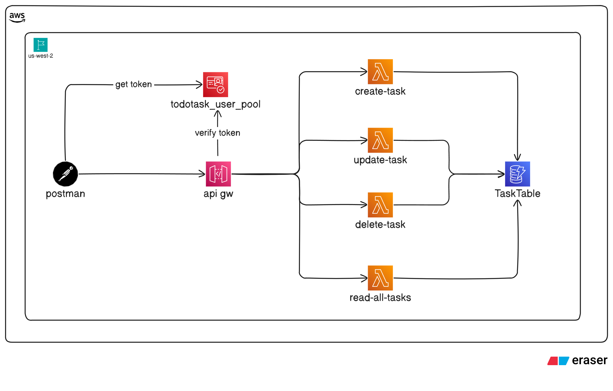

## Project Overview

### Project Description

This project demonstrates how to build a **serverless Todo List backend** on AWS using modern cloud-native services. The core objectives are:

1. **Serverless Backend** – Implemented with **AWS Lambda**.
2. **Database Layer** – **Amazon DynamoDB** is used as the primary data store for efficient, highly available, and serverless storage of todo items.
3. **API Layer** – **AWS API Gateway (REST API)** acts as the interface between clients and the Lambda functions.
4. **Authentication & Authorization** – **AWS Cognito** is integrated to ensure that only authenticated users can access the API endpoints.
5. **Testing & Automation** – **Postman** is used for API testing, request/response automation through JavaScript.
6. **Infrastructure as Code (IaC)** – The entire deployment is automated and reproducible using **Terraform**, ensuring consistent infrastructure provisioning.

This architecture follows a **serverless-first approach**, making the application cost-efficient, highly scalable, and easy to extend for future features.

## Architecture Overview

This project follows a **serverless architecture** leveraging multiple AWS services for scalability, security, and automation.



1. **API Layer (AWS API Gateway)**

   - A **REST API** is provisioned with two resources:

     - `/tasks`
     - `/tasks/{task_id}`

   - The following methods are implemented with **Lambda integration (non-proxy mode)**:

     - `create-task`
     - `update-task`
     - `delete-task`
     - `read-all-tasks`

   - A **body mapping template** (using Apache Velocity Template Language, VTL) is applied in the `delete-task` method. This converts the `DELETE` request into an internal `POST` request, ensuring proper payload handling within Lambda.

2. **Authentication & Authorization (AWS Cognito)**

   - An **Amazon Cognito User Pool** is configured to manage authentication.
   - Implements the **OAuth 2.0 Resource Owner Password Credentials (ROPC) flow** for machine-to-machine communication.
   - Defines **scopes** to control access to API Gateway.
   - Clients must present a valid **JWT token** from Cognito for authenticated API access.

3. **Business Logic (AWS Lambda)**

   - All backend logic is implemented in **Python-based AWS Lambda functions**.
   - These functions handle CRUD operations for the Todo List application.

4. **Data Storage (Amazon DynamoDB)**

   - A **serverless, on-demand DynamoDB table** is used as the data store.

## Prerequisites

Before running the project, ensure you have:

- **AWS Account** with proper permissions and balance.
- **AWS CLI** installed and configured with access and secret token.
- **Terraform** installed.
- **Postman** installed.

## Deployment & Execution

> ⚠️ **Attention**: Make sure you have all the prerequisites mentioned previously before proceeding for deployment.

Follow these steps to provision and test the infrastructure:

#### 1. Initialize Terraform Providers

Run the following command to install the required providers:

```bash
terraform init
```

#### 2. Configure Variables

Create your own `.tfvars` file or use the provided example:

```bash
mv terraform.tfvars.example terraform.tfvars
```

#### 3. Deploy the Infrastructure

Apply the Terraform configuration to provision all resources:

```bash
terraform apply -auto-approve
```

Example output:


#### 4. Retrieve Cognito Client Secret

After deployment, fetch the Cognito App Client Secret with:

```bash
terraform output cognito_app_client_secret
```

#### 5. Configure Postman

- Import the provided **Postman collection** from the repository and open it in Postman.
- Insert the **Client ID** and **Client Secret** into the **Get Token** method body.
- Set the **API endpoint** in the `TARGET_HOST` Postman collection variable.

Example Postman configuration:


#### 6. Destroy the Infrastructure

When finished, you can tear down all provisioned resources with:

```bash
terraform destroy -auto-approve
```
